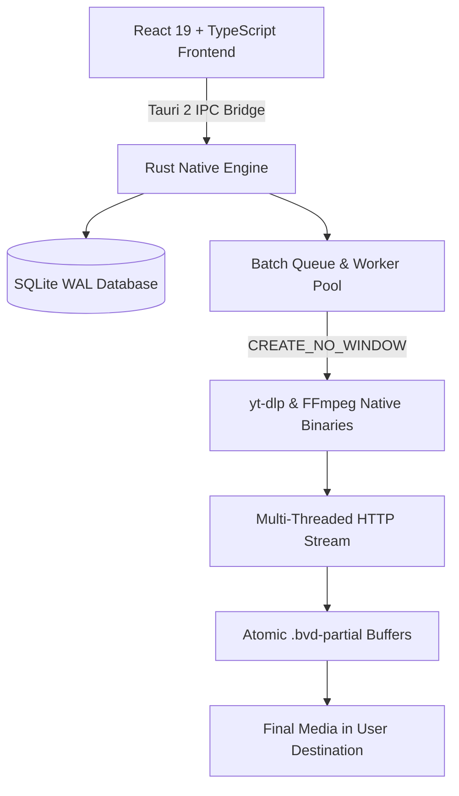

<div align="center">

# 🎬 Bulk Video Downloader

**High-Performance, Enterprise-Grade Desktop Media Download & Queue System**  
*Download pristine 4K, 1080p, and 60 FPS videos with **100% Original Quality and ZERO Watermarks**.*

[](https://github.com/HaseebKaloya)
[-0078D6.svg?style=for-the-badge&logo=windows)](https://github.com/HaseebKaloya)
[](https://github.com/HaseebKaloya)
[](https://github.com/HaseebKaloya)
[](https://github.com/HaseebKaloya)
[](LICENSE.txt)
[](https://github.com/HaseebKaloya)

</div>

---

## 📥 Downloads & Latest Release (v1.0.0)

Grab the latest production packages built for Windows 10 and 11 (64-bit):

| Distribution Package | Format | File Size | Description | SHA-256 Verification |
| :--- | :--- | :--- | :--- | :--- |
| [**Download Setup Installer**](https://github.com/HaseebKaloya/Bulk-Video-Downloader/releases/download/v1.0.0/Bulk-Video-Downloader_1.0.0_x64-setup.exe) | `.exe` | **74.3 MB** | Full Windows Installer with Desktop Shortcut, Start Menu, Startup Registration, and Chrome-Style Foreground WebView2 Downloader | `99B91976DB801D7269B07907B3EFDB43CA2D4248A0AC72038DCE32336CBF6BA2` |
| [**Download Portable Edition**](https://github.com/HaseebKaloya/Bulk-Video-Downloader/releases/download/v1.0.0/Bulk-Video-Downloader_1.0.0_x64_Portable.zip) | `.zip` | **99.9 MB** | Standalone portable archive. Unpack and run anywhere with zero installation required. Ideal for USB drives. | `C5707E8AC4218428C80B3987C2D91E9AE3C2944BE3E1311934BD1DB09AEE4726` |
| [**Checksums Manifest**](https://github.com/HaseebKaloya/Bulk-Video-Downloader/releases/download/v1.0.0/checksums.txt) | `.txt` | **359 B** | Official SHA-256 hashes for cryptographic verification | Universal Verification |

> [!TIP]
> **Recommended for standard users:** Download the **Setup Installer** (`.exe`). It installs cleanly to `C:\Program Files\Bulk Video Downloader`, registers uninstallation in Windows Settings, and ensures all dependencies are verified.

---

## ⚡ Key Highlights

- **100% Watermark-Free Media:** Downloads clean, pristine video files with zero platform branding, overlays, or stamps from TikTok, Instagram Reels, YouTube, Facebook, Twitter/X, and 1,000+ streaming sites.
- **Maximum Resolution & Framerates:** Automatic stream discovery for 4K UHD, 2K, 1080p, 60 FPS, HDR, and pure high-bitrate audio extraction (MP3, FLAC, AAC).
- **Chrome-Style Foreground WebView2 Bootstrapper:** If Microsoft Edge WebView2 runtime is missing on the client's PC, the installer downloads and installs it in the foreground with an official interactive progress dialog (no silent blackouts).
- **Zero Command Prompt Popups:** Native subprocess execution utilizes Windows `CREATE_NO_WINDOW (0x08000000)`—guaranteeing zero flashing black console windows.
- **Industrial Queue Engine:** Handle 10,000+ media links smoothly with zero UI latency using TanStack Virtualization.
- **Atomic File Finalization:** Downloads stream to `.bvd-partial` buffers and atomically swap on checksum completion, guaranteeing no corrupt partial media files.
- **Crash Recovery & Persistence:** SQLite WAL mode ensures tasks, batches, and progress survive sudden system restarts.

---

## 🏗️ Architecture



---

## 🚀 Quick Start & Installation

### Option 1: Setup Installer (`.exe`)
1. Download `Bulk-Video-Downloader_1.0.0_x64-setup.exe`.
2. Run the executable and click **Yes** when Windows UAC prompts for permissions.
3. Follow the custom-branded setup wizard featuring creator **Haseeb Kaloya**.
4. The application is now installed to `C:\Program Files\Bulk Video Downloader` and available on your Desktop and Start Menu.

### Option 2: Portable Edition (`.zip`)
1. Download `Bulk-Video-Downloader_1.0.0_x64_Portable.zip`.
2. Extract the archive to your desired destination.
3. Double-click `Bulk Video Downloader.exe` to run immediately.

### Cryptographic Verification
Verify the authenticity of your release download in Windows PowerShell:
```powershell
Get-FileHash -Algorithm SHA256 "Bulk-Video-Downloader_1.0.0_x64-setup.exe"
# Expected: 99B91976DB801D7269B07907B3EFDB43CA2D4248A0AC72038DCE32336CBF6BA2
```

---

## 🛠️ Technology Stack

| Layer | Technology |
| :--- | :--- |
| **Desktop Shell** | [Tauri 2](https://tauri.app) (Windows x64 Native) |
| **Backend Core** | Rust, Tokio Async, Reqwest, Windows API (`winapi`) |
| **Database** | SQLite with Write-Ahead Logging (WAL) |
| **Frontend UI** | React 19, TypeScript, Pure CSS Modules |
| **State Management** | Zustand |
| **Virtualization** | TanStack Virtual |
| **Installer Engine** | NSIS (Nullsoft Scriptable Install System) with Custom DIB 24-bit Branding |

---

## 👤 Product Owner & Architect

**Haseeb Kaloya**  
- **GitHub:** [@HaseebKaloya](https://github.com/HaseebKaloya)  
- **Email:** [contact.haseebkaloya@gmail.com](mailto:contact.haseebkaloya@gmail.com)  
- **Repository:** [https://github.com/HaseebKaloya/Bulk-Video-Downloader](https://github.com/HaseebKaloya/Bulk-Video-Downloader)

---

## ⚖️ Legal Disclaimer

*Bulk Video Downloader is intended solely for authorized media workflows, educational purposes, personal archival of user-owned material, and public domain media. It does not bypass DRM, encryption, or digital rights access restrictions. Users are solely responsible for ensuring their usage adheres to local copyright laws and third-party terms of service.*

---

© 2026 **Haseeb Kaloya**. Licensed under the [MIT License](LICENSE.txt).
