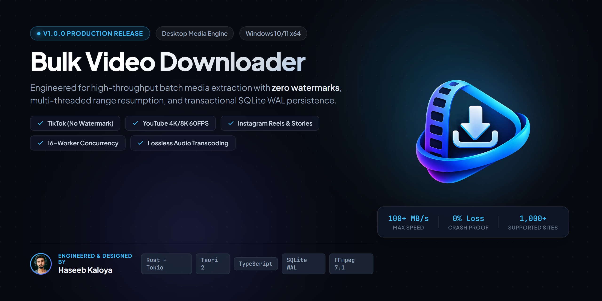
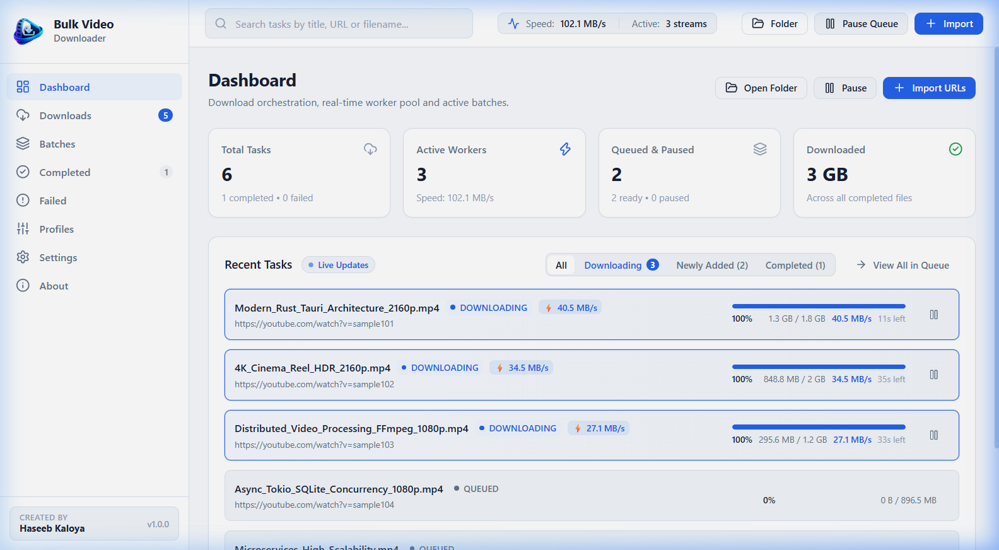
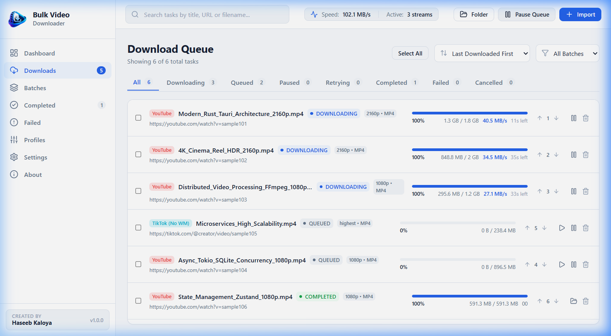
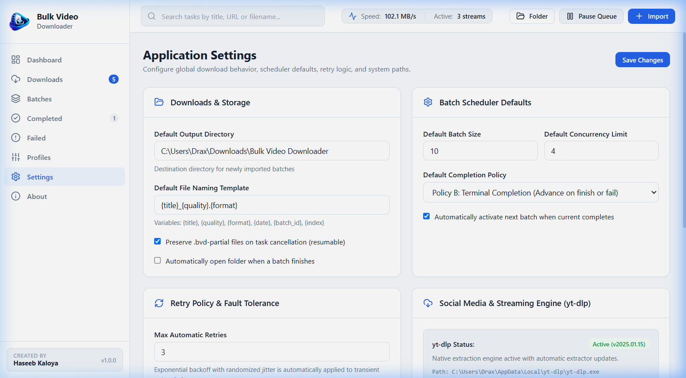
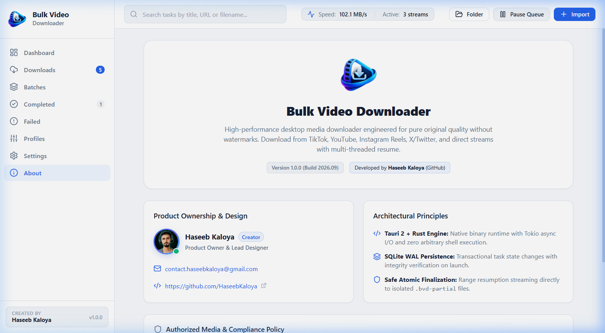

# Bulk Video Downloader



A high-performance desktop application for batch downloading, queuing, and organizing video media from multiple online platforms in original quality without watermarks.

[](https://github.com/HaseebKaloya)
[-0078D6.svg)](https://github.com/HaseebKaloya)
[](https://github.com/HaseebKaloya)
[](https://github.com/HaseebKaloya)
[](LICENSE.txt)
[](https://github.com/HaseebKaloya)

---

## Overview

Bulk Video Downloader is a native desktop download manager engineered for content creators, media researchers, digital archivists, and video professionals who require reliable, large-scale media acquisition. 

Traditional web-based downloaders are often slow, limited to single URLs, inject compression artifacts, or place intrusive platform watermarks over the source material. Bulk Video Downloader resolves these limitations by executing downloads through a native, multi-threaded pipeline directly on your system, pulling the cleanest available streams at original bitrates up to 4K 60 FPS without added overlays or quality loss.

---

## Application Interface

### Active Download Operations & Stream Orchestration
The primary control dashboard displays real-time aggregate speed monitoring, worker allocation, batch throughput, and live per-task stream telemetry:



### Multi-Stream Download Queue & Task Management
Granular control over queued tasks, progress percentages, active transfer rates, estimated remaining times, and priority ordering:



### Engine Configuration & Hardware Diagnostics
Centralized configuration for concurrency limits, completion policies, automatic retry thresholds, and native backend engine diagnostics (bundled yt-dlp and FFmpeg):



### System Architecture & Engineering Profile
Runtime specifications, transactional SQLite WAL database metrics, and developer profile:



---

## Downloads (Version 1.0.0)

Pre-built binaries are available for Windows 10 and Windows 11 (64-bit).

| Package | Format | File Size | Target Architecture | SHA-256 Checksum |
| :--- | :--- | :--- | :--- | :--- |
| **Windows Setup Installer** | `.exe` | 74.3 MB | Windows 10 / 11 (x64) | `99B91976DB801D7269B07907B3EFDB43CA2D4248A0AC72038DCE32336CBF6BA2` |
| **Portable Standalone Edition** | `.zip` | 99.9 MB | Windows 10 / 11 (x64) | `C5707E8AC4218428C80B3987C2D91E9AE3C2944BE3E1311934BD1DB09AEE4726` |
| **Official Checksums** | `.txt` | 359 B | Universal | Official Hash Manifest |

Direct download links are hosted under the [GitHub Releases](https://github.com/HaseebKaloya/Bulk-Video-Downloader/releases) tab.

---

## Installation

### Method 1: Standard Windows Setup Installer (Recommended)

1. Download `Bulk-Video-Downloader_1.0.0_x64-setup.exe`.
2. Run the installer and accept the Windows User Account Control (UAC) prompt.
3. The wizard will install the software to `C:\Program Files\Bulk Video Downloader`, register a Desktop shortcut, add a Start Menu shortcut, and optionally register the app for Windows Startup.
4. If your system does not already have the Microsoft Edge WebView2 runtime installed, the setup wizard will launch Microsoft's official downloader in the foreground with an active progress bar to complete the environment setup.

### Method 2: Portable Edition

1. Download `Bulk-Video-Downloader_1.0.0_x64_Portable.zip`.
2. Extract the contents to any directory or USB drive.
3. Execute `Bulk Video Downloader.exe` directly. No administrative privileges or installation steps are required.

### Cryptographic Verification

To verify the integrity and authenticity of the downloaded installer before running, execute the following command in Windows PowerShell:

```powershell
Get-FileHash -Algorithm SHA256 "Bulk-Video-Downloader_1.0.0_x64-setup.exe"
```

Confirm that the output matches:
```text
99B91976DB801D7269B07907B3EFDB43CA2D4248A0AC72038DCE32336CBF6BA2
```

For the portable archive:
```powershell
Get-FileHash -Algorithm SHA256 "Bulk-Video-Downloader_1.0.0_x64_Portable.zip"
```

Confirm that the output matches:
```text
C5707E8AC4218428C80B3987C2D91E9AE3C2944BE3E1311934BD1DB09AEE4726
```

---

## Core Capabilities

### Clean Media Extraction Without Watermarks
- **Original Media Fidelity:** Retrieves raw source video streams without platform-applied branding, moving watermarks, or re-encoding artifacts from supported services including TikTok, YouTube, Instagram Reels, Facebook, and X (Twitter).
- **Maximum Available Resolutions:** Automatically detects and offers resolutions up to 4K UHD (2160p), 1440p, 1080p, and high frame rates (60 FPS / HDR).
- **Audio Extraction:** High-bitrate audio stream extraction with conversion options to MP3, FLAC, AAC, or WAV with embedded metadata tags.

### Queue and Batch Management
- **High-Capacity Queue Engine:** Capable of tracking queues containing thousands of items without interface stutter, powered by virtualized list rendering.
- **Flexible Batch Import:** Accepts bulk URLs via direct text paste, line-separated `.txt` files, structured `.csv` files, or JSON imports, with automatic duplicate link detection.
- **Configurable Concurrency:** Granular control over the number of simultaneous active downloads (1 to 10 parallel threads) to balance network throughput against CPU and disk usage.
- **Speed Limits:** Global download rate throttling to prevent saturation of shared internet connections.

### Atomic File Safety and Resumption
- **Partial File Buffering:** Active downloads stream directly to dedicated `.bvd-partial` buffers. Files are only renamed to their final destination upon complete, verified transfer, preventing incomplete or corrupt video files in your destination folders.
- **HTTP Range Resumption:** Interrupted transfers automatically resume from the last received byte when the network reconnects.
- **Database Persistence:** Download tasks, batches, history, and user preferences are recorded transactionally using an embedded SQLite engine operating in Write-Ahead Logging (WAL) mode. System reboots or unexpected power cuts do not result in database corruption.

### Windows System Integration
- **Silent Subprocesses:** Background engine processes (such as extraction and stream assembly) are executed using native Windows creation flags (`CREATE_NO_WINDOW`), preventing any flashing command-prompt windows during operation.
- **Foreground WebView2 Setup:** Modern installer logic detects system components and displays interactive progress dialogs rather than failing silently.

---

## User Guide

### 1. Adding URLs
- Open the application and click **Import Links** on the dashboard.
- Paste single or multiple URLs into the input area, or drag-and-drop a `.txt` or `.csv` file containing URLs.
- The validator parses the links, removes duplicate entries, and presents the detected media list.

### 2. Selecting Download Profiles
- Choose a target resolution (Best Available, 4K, 1080p, 720p, or Audio Only).
- Choose the output container (`.mp4`, `.mkv`, or `.mp3`).
- Select or change the output directory.

### 3. Monitoring Downloads
- Click **Start Batch** to begin downloading.
- The main queue displays real-time download speeds, downloaded byte counts, elapsed times, and visual progress indicators for every task.
- Individual tasks can be paused, resumed, canceled, or prioritized.

### 4. Handling Failures
- The built-in retry mechanism automatically handles temporary network drops using exponential backoff with randomized jitter.
- If a link fails due to access restrictions or a deleted source, the task is flagged with the specific reason in the **Failed Tasks** tab for inspection.

---

## Technical Architecture

Bulk Video Downloader utilizes a split-process architecture combining a lightweight native Rust core with a responsive web-rendered interface:

```text
+-------------------------------------------------------------+
|                     React 19 Frontend                       |
|           (TypeScript, CSS Modules, Zustand State)           |
+-------------------------------------------------------------+
                              |
                     Tauri 2 IPC Bridge
                              |
+-------------------------------------------------------------+
|                      Rust Core Engine                       |
|  - Async Task Scheduler (Tokio Runtime)                     |
|  - SQLite WAL Database (State & Persistence)                |
|  - Subprocess Execution (CREATE_NO_WINDOW)                   |
|  - HTTP Range Streaming & File Integrity                    |
+-------------------------------------------------------------+
                              |
               Native Runtime Dependencies
              (Bundled yt-dlp & FFmpeg x64)
```

### Technology Stack

| Layer | Component | Notes |
| :--- | :--- | :--- |
| **Desktop Shell** | Tauri 2 | Native Windows x64 binary wrapper |
| **Core Backend** | Rust (v1.75+) | Multi-threaded async runtime with Tokio |
| **Database** | SQLite (WAL Mode) | Zero-maintenance transactional storage |
| **UI Framework** | React 19 + TypeScript | Strict typing with component modularity |
| **Styling** | Pure CSS Modules | Zero Tailwind or heavy utility-CSS dependencies |
| **State Management** | Zustand | Predictable UI state synchronization |
| **List Virtualization** | TanStack Virtual | Efficient rendering of large queue tables |
| **Installer Engine** | NSIS Modern UI 2 | Custom per-machine installer with DIB branding |

---

## System Requirements

| Specification | Minimum Requirement | Recommended |
| :--- | :--- | :--- |
| **Operating System** | Windows 10 (Version 19041+) 64-bit | Windows 11 64-bit |
| **Processor** | Intel Core i3 / AMD Ryzen 3 or equivalent | Intel Core i5 / AMD Ryzen 5 or higher |
| **Memory (RAM)** | 4 GB RAM | 8 GB RAM (for concurrent 4K multiplexing) |
| **Available Disk Space** | 300 MB for installation | Fast SSD storage recommended for downloads |
| **Network** | Broadband internet connection | High-speed fiber connection |

---

## Building from Source

To compile Bulk Video Downloader on your local machine:

### Prerequisites
1. **Node.js**: v18.0.0 or higher ([nodejs.org](https://nodejs.org))
2. **Rust**: Rust toolchain with `cargo` ([rustup.rs](https://rustup.rs))
3. **C++ Build Tools**: Visual Studio 2022 C++ Build Tools with the Windows 10/11 SDK.

### Build Steps

```powershell
# 1. Clone the repository
git clone https://github.com/HaseebKaloya/Bulk-Video-Downloader.git
cd Bulk-Video-Downloader

# 2. Install frontend dependencies
npm install

# 3. Launch development mode (hot-reloading enabled)
npm run tauri dev

# 4. Compile a production release (Installer and MSI)
npm run tauri build
```

The compiled setup installer and release binaries will be generated under `src-tauri/target/release/bundle/nsis/`.

---

## Author & Project Ownership

- **Product Owner & Lead Developer:** **Haseeb Kaloya**
- **GitHub:** [@HaseebKaloya](https://github.com/HaseebKaloya)
- **Email Contact:** [contact.haseebkaloya@gmail.com](mailto:contact.haseebkaloya@gmail.com)
- **Project Repository:** [https://github.com/HaseebKaloya/Bulk-Video-Downloader](https://github.com/HaseebKaloya/Bulk-Video-Downloader)

---

## Compliance and Authorized Use

Bulk Video Downloader is intended strictly for authorized workflows, educational media preservation, personal backups of user-owned content, and open media in the public domain. This software does not bypass digital rights management (DRM), access control systems, or paywalled content. Users are solely responsible for ensuring that their media activities comply with applicable intellectual property laws and the terms of service of each respective host platform.

---

## License

This project is licensed under the MIT License. See the [LICENSE](LICENSE.txt) file for details.
