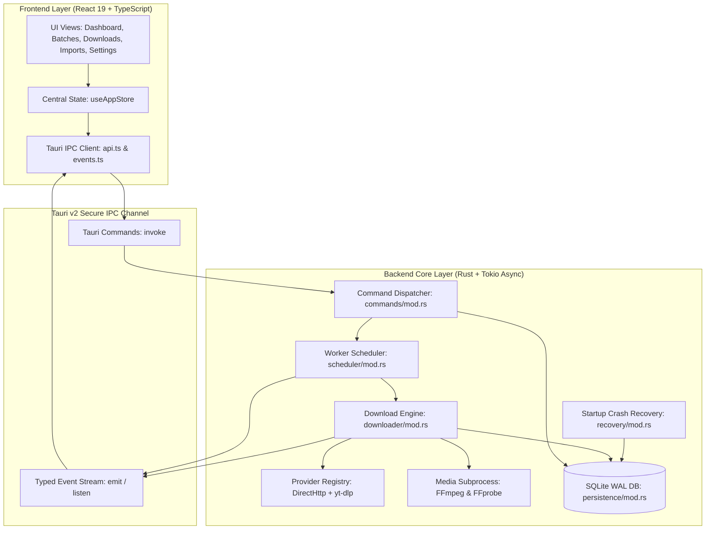

# Bulk Video Downloader — Complete Architecture & Cross-Platform Guide

**Author:** Haseeb Kaloya (<contact.haseebkaloya@gmail.com>)  
**Product:** Bulk Video Downloader (v1.0.0)  
**Core Technologies:** Tauri v2, Rust (2021 Edition), Tokio, React 19, TypeScript, Vite, SQLite (WAL mode).

---

## 1. System Topology & Architecture

The application is structured into two primary layers connected by Tauri's secure Inter-Process Communication (IPC) boundary:



---

## 2. Comprehensive Directory & File Breakdown

### Root Project Structure
| File / Directory | Purpose | Key Responsibilities |
| :--- | :--- | :--- |
| `package.json` | Node dependencies & scripts | Declares React 19, `@tauri-apps/api`, `@tanstack/react-virtual`, `lucide-react`, and Vite build pipeline. |
| `vite.config.ts` | Frontend Bundler Config | Configures React plugin, dev server port `1420`, and strict Tauri HMR integration. |
| `tsconfig.json` | TypeScript Configuration | Strict type checking rules, DOM libraries, and ESNext target. |
| `index.html` | HTML Entry Template | Application viewport, root DOM mount `#root`, and brand title. |
| `bin/` | Bundled Tooling Binaries | Local development copies of `ffmpeg.exe`, `ffprobe.exe`, and `yt-dlp.exe`. |
| `docs/` | System Documentation Suite | Architecture, user guide, recovery design, testing strategy, and status tracking. |
| `src/` | Frontend Source Code | React components, UI design tokens, stores, and API wrappers. |
| `src-tauri/` | Backend Source Code | Rust crates, Tauri configuration, database persistence, and download engines. |

---

### Frontend Modules (`src/`)

#### 1. Core & Layout (`src/components/layout/`)
* **`Layout.tsx` & `Layout.module.css`**: The main responsive application grid consisting of TitleBar, Sidebar, Header, and the active view outlet.
* **`Header.tsx` & `Header.module.css`**: Displays global connection status, active worker counts, queue pause/resume master toggle, and the "+ New Import" trigger.
* **`Sidebar.tsx` & `Sidebar.module.css`**: Vertical navigation containing brand logo, tab buttons (`Dashboard`, `Batches`, `Downloads`, `Completed`, `Failed`, `Profiles`, `Settings`, `About`), dynamic counter badges, and the developer attribution card (`Haseeb Kaloya v1.0.0`).

#### 2. Reusable UI Components (`src/components/ui/`)
* **`Button.tsx`**: Universal button component with support for variants (`primary`, `secondary`, `danger`, `ghost`), loading spinners, and size adjustments.
* **`Badge.tsx`**: Dynamic status pill (`queued`, `downloading`, `completed`, `failed`, `paused`) with color-coded tokens.
* **`ProgressBar.tsx`**: Smooth animated progress bar supporting indeterminate pulses and striped progress states.
* **`Modal.tsx` & `ConfirmDialog.tsx`**: Accessible modal overlay for forms and safety confirmation dialogs (e.g. batch deletion).
* **`ToastContainer.tsx`**: Real-time non-blocking notification toast banner for system alerts.
* **`FormControls.tsx`**: Styled inputs, selects, toggles, and file-picker wrappers.

#### 3. Feature Views (`src/features/`)
* **`dashboard/DashboardView.tsx`**:
  * Displays system health, disk space gauges, and aggregate download metrics.
  * **Live Stream Workers:** Shows downloading videos with live speeds (`MB/s`), ETAs, and pause buttons at the top.
  * **LIFO Completed Stream:** Shows recently finished videos with newest downloads at the very top.
  * Filter chips (`All`, `Downloading`, `Newly Added`, `Completed`).
* **`imports/ImportModal.tsx`**:
  * Multi-format import dialog: Single URL, bulk text paste, CSV file upload, and JSON batch import.
  * Duplicate URL detection and download profile selector.
* **`downloads/DownloadsView.tsx`**:
  * High-performance virtualized queue list powered by `@tanstack/react-virtual` (renders thousands of items with zero lag).
  * Sort dropdown: `Last Downloaded First (LIFO)`, `Newest Added First`, and `Queue Priority`.
  * Inline controls: Pause, Resume, Cancel, Retry, Priority Up/Down, and Open in Folder.
* **`batches/BatchesView.tsx`**:
  * Displays batches with completion policy tags (A, B, C, D) and circular progress rings.
  * Batch management: Start Batch, Pause Batch, Stop Batch.
  * **Bulk Selection:** Checkboxes per card, `Select All / Deselect All`, `Delete Selected`, and `Clear All Batches`.
* **`completed/CompletedView.tsx`**:
  * History table of finished downloads.
  * Quick-launch file actions: Open containing directory, play file, and export history to CSV.
* **`failed/FailedView.tsx`**:
  * Diagnostic triage view displaying exact error codes, network failures, and subprocess logs.
  * "Retry All Failed" and individual retry triggers with backoff indicators.
* **`profiles/ProfilesView.tsx`**:
  * Pre-configured output profiles: Resolution (4K, 1080p, 720p), codec format (MP4, MKV, WebM, MP3, M4A), and destination directories.
* **`settings/SettingsView.tsx`**:
  * User preferences: Concurrency limits (1–16 workers), download rate limiters, retry attempts, timeout values, and naming template formatters.
  * Binary health checks: Direct status indicators for `ffmpeg` and `yt-dlp`.
* **`about/AboutView.tsx`**:
  * Developer credits (Haseeb Kaloya), system diagnostics, architecture links, and embedded binary path inspectors.

#### 4. State Management & API (`src/services/` & `src/stores/`)
* **`services/api.ts`**: Pure TypeScript wrapper mapping 35+ Tauri `invoke()` calls into typed Promise functions.
* **`services/events.ts`**: Subscribes to real-time Rust backend events (`download.progress`, `download.status`, `batch.status`, etc.).
* **`stores/useAppStore.ts`**: Unified Zustand store keeping state synchronized between backend SQLite updates and the React UI.
* **`styles/tokens.css`**: Design tokens defining dark-mode HSL color schemes, border radiuses, typography, and spacing scales.

---

### Backend Core Modules (`src-tauri/src/`)

```text
src-tauri/src/
├── main.rs            # Application entry binary
├── lib.rs             # Application setup, plugin registration & command routing
├── commands/mod.rs    # 35+ Tauri IPC Command Handlers
├── domain/mod.rs      # Core domain models, enums & state invariants
├── downloader/mod.rs  # Streaming HTTP engine, range resume & atomic renaming
├── errors/mod.rs      # Central error types & user-facing guidance messages
├── events/mod.rs      # Typed event emitter abstraction
├── media/mod.rs       # FFmpeg/FFprobe subprocess orchestrator & metadata probe
├── persistence/mod.rs # SQLite WAL connection, migrations & transactional queries
├── providers/mod.rs   # Provider interfaces (Direct HTTP & Extensible Adapters)
│   └── ytdlp.rs       # yt-dlp child process wrapper, stream extractor & parser
├── recovery/mod.rs    # Crash recovery scanner, partial file reconciliation
└── scheduler/mod.rs   # Dynamic worker pool, batch execution policies & concurrency
```

#### Detailed Breakdown of Rust Engines:

1. **`lib.rs` (Initialization & Lifecycle)**:
   * Initializes structured logging via `tracing-subscriber`.
   * Automatically resolves the SQLite database path in the OS application data directory (`bvd_storage.db`).
   * Runs `RecoveryManager::run_startup_recovery()` before starting the UI to clean up interrupted tasks from previous crashes.
   * Starts the background scheduler loop.
   * Registers all Tauri commands and sets custom brand icons.

2. **`downloader/mod.rs` (Resilient Download Engine)**:
   * Uses `reqwest` with `rustls-tls` (pure Rust TLS, no OpenSSL external dependency issues across platforms).
   * **Byte-Range Resume (`Range: bytes=X-`):** Automatically checks existing size on disk. If a download was interrupted at 400MB of 1GB, it requests the remaining 600MB instead of restarting from byte 0.
   * **Atomic Staging (`.bvd-partial`):** Writes directly to `<filename>.bvd-partial`. Flushes buffers to disk, verifies file integrity, and atomically renames to the target filename.
   * **Throttled Progress:** Throttles IPC updates to 4–10 events/second to keep the UI smooth at 60 FPS without saturating IPC channels.

3. **`persistence/mod.rs` (SQLite Database & State of Truth)**:
   * Configures SQLite in **WAL mode (`PRAGMA journal_mode = WAL`)** with `NORMAL` synchrony for high-concurrency read/write without database locking.
   * Schema migrations track version history in `schema_version`.
   * Stores `batches`, `downloads`, `download_profiles`, and `app_settings`.
   * Houses the status-aware LIFO query logic (`ORDER BY completed_at DESC`) ensuring the latest finished video appears at the top.

4. **`scheduler/mod.rs` (Worker Pool & Batch Policies)**:
   * Manages concurrent download slots via Tokio semaphores (`tokio::sync::Semaphore`).
   * Enforces Batch Completion Policies:
     * **Policy A (AllSuccessful):** Batch completes only when every item succeeds.
     * **Policy B (Terminal):** Batch halts immediately if any item encounters an unrecoverable failure.
     * **Policy C (PauseOnFailure):** Pauses queue upon failure and prompts the user.
     * **Policy D (ContinueWithRetry):** Retries transient network failures using exponential backoff with randomized jitter.

5. **`providers/ytdlp.rs` (yt-dlp Social Media Adapter)**:
   * Manages child process spawning of `yt-dlp`.
   * Parses standard output streams for download percentage, speed, format combination, and ETA.
   * Supports cancellation tokens for instant process termination without orphan zombie processes.

6. **`media/mod.rs` (FFmpeg & FFprobe Integration)**:
   * Validates media containers and inspects stream audio/video codecs.
   * Muxes separate high-res video (DASH/HLS) and audio tracks into a single container (e.g. `.mp4` or `.mkv`).
   * Extracts clean thumbnail previews.

7. **`recovery/mod.rs` (Crash Recovery System)**:
   * Automatically executes on app startup.
   * Scans SQLite for any tasks marked `DOWNLOADING` or `PREPARING` when the app last quit (e.g. power failure, crash, killed process).
   * Verifies partial files on disk, resets task states to `PAUSED` or `QUEUED`, and returns a detailed `RecoverySummary` to the UI.

---

## 3. Deep Dive: Cross-Platform Technology Architecture

### Why Tauri v2 Over Electron?

| Metric / Feature | Tauri v2 (Our Stack) | Traditional Electron |
| :--- | :--- | :--- |
| **Binary Size** | **~15–30 MB** (bundled with Rust engine) | ~120–180 MB minimum |
| **RAM Consumption** | **~40–80 MB** | ~350–700 MB |
| **Webview Engine** | Native OS Webview (WebView2 / WebKit) | Bundles entire duplicate Chromium browser |
| **Backend Runtime** | Native compiled Rust (zero garbage collection) | Node.js (V8 runtime + JS overhead) |
| **Security** | Strict IPC command isolation & native permissions | Full Node.js bridge exposure |

---

### Platform-Specific Breakdown

```
                             Cross-Platform Abstraction
                                          │
       ┌──────────────────────────────────┼──────────────────────────────────┐
       ▼                                  ▼                                  ▼
    Windows                             macOS                              Linux
───────────────                    ───────────────                    ───────────────
• Webview: WebView2                • Webview: WKWebView               • Webview: WebKitGTK
• Binaries: .exe                   • Binaries: Mach-O (Universal)     • Binaries: ELF
• Paths: C:\Users\...              • Paths: /Users/...                • Paths: /home/...
• Packages: .msi, NSIS (.exe)      • Packages: .dmg, .app             • Packages: .deb, .AppImage
• DB: %AppData%\Roaming            • DB: ~/Library/Application Sup.   • DB: ~/.local/share
```

#### 1. Windows Architecture
* **Webview Runtime:** Uses Microsoft Edge WebView2 (pre-installed on Windows 10/11).
* **Binary Discovery:**
  * Checks executable directory, `resources/bin/`, and `bin/`.
  * Names: `ffmpeg.exe`, `ffprobe.exe`, `yt-dlp.exe`.
* **Installer Targets:**
  * **NSIS (`.exe` setup):** Standard user installer with desktop shortcut and uninstaller.
  * **WiX (`.msi`):** Enterprise-grade Windows Installer package.
* **Storage Path:** Resolved via `app.path().app_data_dir()`, pointing to:
  `C:\Users\<User>\AppData\Roaming\com.haseebkaloya.bulk-video-downloader\`

#### 2. macOS Architecture
* **Webview Runtime:** Native Apple WKWebView (built into macOS).
* **Binary Discovery & Universal Binaries:**
  * Binaries must be compiled for Apple Silicon (`aarch64-apple-darwin`) or Intel (`x86_64-apple-darwin`), or packaged as Universal Binaries using `lipo`.
  * Names: `ffmpeg`, `ffprobe`, `yt-dlp` (no `.exe` extension).
  * Packaging location: `Bulk Video Downloader.app/Contents/Resources/bin/`.
* **Code Signing & Gatekeeper:**
  * macOS requires code signing (`codesign`) and Apple Notarization for distribution outside the Mac App Store.
* **Storage Path:**
  `/Users/<User>/Library/Application Support/com.haseebkaloya.bulk-video-downloader/`

#### 3. Linux Architecture
* **Webview Runtime:** WebKitGTK (`libwebkit2gtk-4.1`).
* **Packaging Targets:**
  * **AppImage:** Self-contained, portable executable that runs on Ubuntu, Fedora, Arch, Debian, etc.
  * **Debian (`.deb`):** Native package for Ubuntu/Debian with apt dependency management.
* **Storage Path:**
  Follows XDG specifications: `~/.local/share/com.haseebkaloya.bulk-video-downloader/`

---

### Cross-Platform Binary Resolution Code Pattern

In both [`ytdlp.rs`](file:///c:/Users/Drax/Desktop/Bulk%20Video%20Downloader/Bulk-Video-Downloader/src-tauri/src/providers/ytdlp.rs) and [`media/mod.rs`](file:///c:/Users/Drax/Desktop/Bulk%20Video%20Downloader/Bulk-Video-Downloader/src-tauri/src/media/mod.rs), binary discovery dynamically adapts at runtime without hardcoded OS paths:

```rust
pub fn find_binary(name: &str) -> PathBuf {
    // 1. Determine platform extension
    let exe_name = if cfg!(target_os = "windows") {
        if name.ends_with(".exe") { name.to_string() } else { format!("{}.exe", name) }
    } else {
        name.trim_end_matches(".exe").to_string()
    };

    // 2. Search next to running executable (Windows setup / macOS .app bundle / Linux AppImage)
    if let Ok(current_exe) = std::env::current_exe() {
        if let Some(exe_dir) = current_exe.parent() {
            let candidates = [
                exe_dir.join(&exe_name),
                exe_dir.join("bin").join(&exe_name),
                exe_dir.join("resources").join("bin").join(&exe_name),
                exe_dir.join("..").join("Resources").join("bin").join(&exe_name), // macOS App bundle
                exe_dir.join("..").join("lib").join("bin").join(&exe_name),       // Linux package
            ];
            for candidate in &candidates {
                if candidate.is_file() { return candidate.clone(); }
            }
        }
    }

    // 3. Fallback to current working directory (Development mode)
    if let Ok(cwd) = std::env::current_dir() {
        let candidates = [
            cwd.join(&exe_name),
            cwd.join("bin").join(&exe_name),
            cwd.join("src-tauri").join("bin").join(&exe_name),
        ];
        for candidate in &candidates {
            if candidate.is_file() { return candidate.clone(); }
        }
    }

    // 4. Fallback to System PATH
    PathBuf::from(exe_name)
}
```

---

## 4. Building & Deployment Guide Across Platforms

### 1. Windows Production Build
```powershell
# From project directory:
cd "Bulk-Video-Downloader"

# Build production installers (.exe NSIS & .msi):
npm run tauri build
```
* **Output Artifacts:**
  * `src-tauri/target/release/bundle/nsis/Bulk Video Downloader_1.0.0_x64-setup.exe`
  * `src-tauri/target/release/bundle/msi/Bulk Video Downloader_1.0.0_x64_en-US.msi`

---

### 2. macOS Production Build
On a macOS machine:
```bash
# 1. Place macOS binaries of ffmpeg, ffprobe, and yt-dlp inside src-tauri/bin/
chmod +x src-tauri/bin/*

# 2. Build .dmg and .app bundle:
npm run tauri build
```
* **Output Artifacts:**
  * `src-tauri/target/release/bundle/dmg/Bulk Video Downloader_1.0.0_universal.dmg`
  * `src-tauri/target/release/bundle/macos/Bulk Video Downloader.app`

---

### 3. Linux Production Build
On an Ubuntu/Debian system:
```bash
# 1. Install prerequisites:
sudo apt-get update
sudo apt-get install -y libwebkit2gtk-4.1-dev build-essential curl wget file libssl-dev libgtk-3-dev libayatana-appindicator3-dev librsvg2-dev

# 2. Place Linux ELF binaries in src-tauri/bin/ and ensure executable permissions:
chmod +x src-tauri/bin/*

# 3. Build AppImage and .deb:
npm run tauri build
```
* **Output Artifacts:**
  * `src-tauri/target/release/bundle/appimage/bulk-video-downloader_1.0.0_amd64.AppImage`
  * `src-tauri/target/release/bundle/deb/bulk-video-downloader_1.0.0_amd64.deb`

---

## 5. Automated Cross-Platform CI/CD (GitHub Actions)

To automatically compile for Windows, macOS, and Linux on every release, place this workflow in `.github/workflows/release.yml`:

```yaml
name: Release App

on:
  push:
    tags:
      - 'v*'

jobs:
  build-tauri:
    strategy:
      fail-fast: false
      matrix:
        include:
          - platform: 'windows-latest'
            args: ''
          - platform: 'macos-latest'
            args: '--target universal-apple-darwin'
          - platform: 'ubuntu-22.04'
            args: ''

    runs-on: ${{ matrix.platform }}
    steps:
      - uses: actions/checkout@v4
      - name: Setup Node.js
        uses: actions/setup-node@v4
        with:
          node-version: 20
          cache: 'npm'

      - name: Install Rust Stable
        uses: dtolnay/rust-toolchain@stable

      - name: Install Linux Dependencies (Ubuntu only)
        if: matrix.platform == 'ubuntu-22.04'
        run: |
          sudo apt-get update
          sudo apt-get install -y libwebkit2gtk-4.1-dev libappindicator3-dev librsvg2-dev patchelf

      - name: Install Node Dependencies
        run: npm ci

      - name: Build Tauri Bundle
        uses: tauri-apps/tauri-action@v0
        env:
          GITHUB_TOKEN: ${{ secrets.GITHUB_TOKEN }}
        with:
          tagName: v__VERSION__
          releaseName: 'Bulk Video Downloader v__VERSION__'
          releaseBody: 'See release notes for changes.'
          releaseDraft: true
          prerelease: false
          args: ${{ matrix.args }}
```

---

## 6. Developer Playbook: How We Will Make Changes Together

Whenever you want to modify, enhance, or adjust anything in the project, we will follow this clear 4-step process:

1. **You describe your vision:** You specify what UI element, feature, or logic you want to change (e.g. modifying a button, adding a new setting, tweaking download speeds, or changing colors).
2. **I propose the exact changes:** I will outline which exact file and lines need adjusting before touching anything.
3. **Your approval:** You give the go-ahead.
4. **Execution & Verification:** I apply the code change, test it, and verify that the application compiles cleanly.
